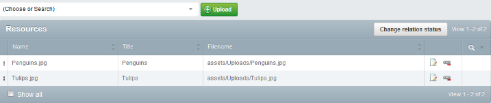

# SilverStripe Grid Field Extras

## Requirements

* SilverStripe 3.1

## Maintainers

* Guy Watson (guy.watson@internetrix.com.au)

## Description

This module provides a number of useful extensions and extras when working with gridfields

## Usage

### Better Grid Field Many Relation Handler

This component fixes a bug in `GridFieldManyRelationHandler` where object are duplicated because relationships on a many_many table have different sort values.
It also sets the pagination page to 1, when toggling in and out of the "Change relation status" modes

### Grid Field Advanced Filter Header

The `GridfieldAdvancedFilterHeader` component can add custom fields to a gridfield when filtering. The following example allows the user to filter based on a folder selected from a `TreeDropdownField`

	$grid = new GridField(
		'ExampleGrid',
		'Example Grid',
		$this->Items(),
		GridFieldConfig::create()
			->addComponent(new GridFieldButtonRow('before'))
			->addComponent(new GridFieldToolbarHeader())
			->addComponent($columns = new GridFieldDataColumns())
			->addComponent($filter = new GridFieldAdvancedFilterHeader())
	);

	$columns->setDisplayFields(array(
		'Name' 			=> 'Name',
		'Title'			=> 'Title',
		'Filename'		=> 'Filename'
	));

You can customise what form fields are used on the gridfield to filter specific columns. e.g. 

	$filter->setFilterFields(array(
		'Filename'  => function($record, $column, $grid) { return new TreeDropdownField('Filename', '', 'Folder'); }
	));

The `TreeDropdownField` returns the objects ID. The following method can be used to lookup another field based on the object ID returned by the `TreeDropdownField`

	$filter->setIDToFieldMaps(array(
		'Filename'  => array(
			'Class'			=> 'Folder',
			'LookUpField'	=> 'Filename'
		)
	));
	

### Grid Field Editable Link Columns

Edit linkable objects directly from the gridfield

### Editable Columns File Attachment Field

Upload a file directly into the has_one relationship inside an editable column

### Grid Field Upload File

The `GridFieldUploadFile` component allows files to be uploaded into a selected folder and then added to the gridfields relation list.

### Versioned Grid Field Sortable Rows

The `VersionedGridFieldSortableRows` component allows versioned objects (stage, live) to be sorted in a model admin.
Both the stage and live tables will be updated. 

### GridFieldConfig Fields

Use **GridFieldConfig_ManySortableRecordEditor** and **GridFieldConfig_ManySortableRelationEditor** as GridField config for quick ways to configure a GridField.

